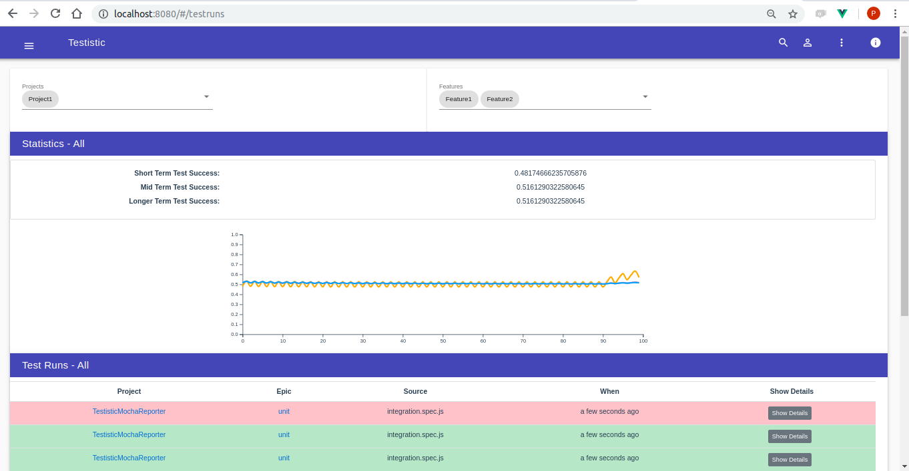

# Testistic

# Why
*A procedure for critical evaluation; a means of determining the presence, quality, or truth of something; a trial*

A system which aggregates test results in support of the following questions.
- How is construction of the system going?
- What is yet to start working in an environment?
- What isnt working now that we made a change?
- Has the system under test been extended or improved as a result of change

# What

The system provides an API such that test cases can be submitted

A processing component which can agregrate test results.

A UI for filtering of test results across the dimensions of time, target, feature, epic, task.

# How

### Testistic-Model
[Repository](http://bayeslife.github.com/testistic-model)

A domain model

### Testistic-Storage
Storage of test data as a stream of kafka messages.

[Source](http://bayeslife.github.com/testability-storage)

### Testistic-API

[Repository](https://github.com/bayeslife/testistic-api)

APIs which let anyone push tests cases and results.

### Testistic-UI

[Repository](https://github.com/bayeslife/testistic-ui)

A VueJS UI which allows selection of test results by
- Target
- Feature, Epic, Task
- Time Period

### Testistic-Mocha-Reporter
[Repository](https://github.com/bayeslife/testistic-mocha-reporter)

A Mocha Reporter which a third party can use which pushes test data to testistic.

### Testistic-Jest-Reporter
[Repository](https://github.com/bayeslife/testistic-jest-reporter)

A Jest Reporter which a third party can use which pushes test data to testistic.

### Testistic-Stream
[Repository](https://github.com/bayeslife/testistic-stream)

Process the stream of test events in order to compute aggregate information.

### Testistic-Deployment
[Repository](https://github.com/bayeslife/testistic-deployment)

Deployment into kubernets on Google Cloud Platform
